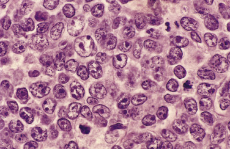
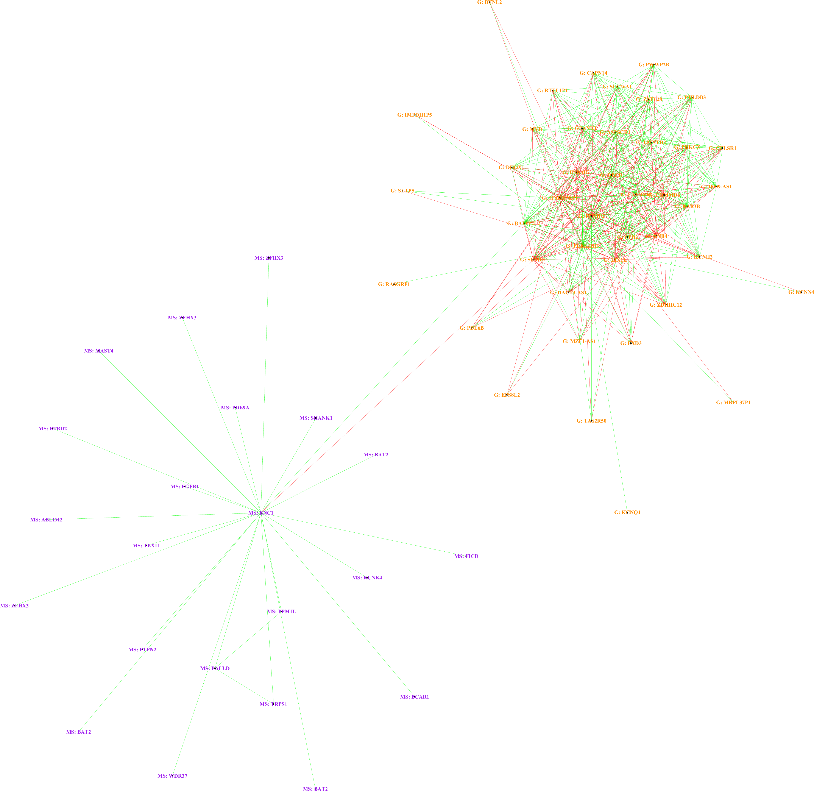
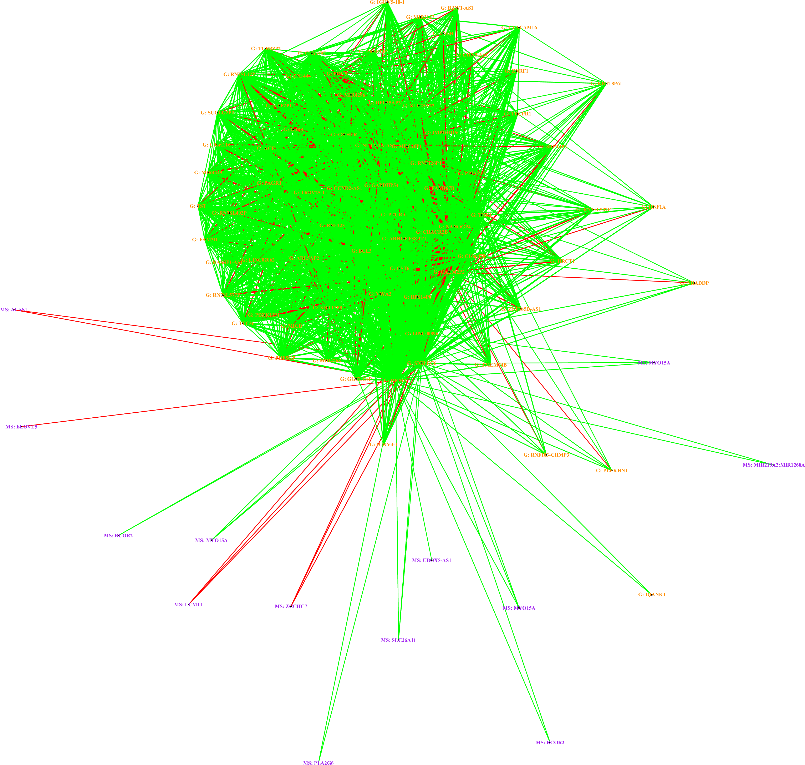

```{r setup, include=FALSE}
knitr::opts_chunk$set(echo = FALSE)
```

## Outline

**Hypothesis**: Integration of multi-omics signals will elucidate gene networks involved in DLBCL relapse after CAR T-cell therapy.

1. **What**: Diffuse Large B-Cell Lymphoma

2. **Why**: Approximately half of patients with DLBCL treated with CAR T-cells will relapse

3. **How**: Multi-omics integration using sparse multiple cannonical correlation analysis

## What: Diffuse Large B-Cell Lymphoma

```{r, fig.align='center', out.width="45%", fig.cap = "Micrograph of DLBCL (Field stain)"}

```

- Most common non-Hodgkin lymphoma (5.6 per 100,000 persons per year), arises from mature B lymphocytes

- Average 5-year relative survival rate of 63\% (72\% for all NHL)

- **Treatment:** R-CHOP/EPOCH $\rightarrow$ salvage/HCT $\rightarrow$ CAR T-cell

## Multiple Canonical Correlation Analysis: Definition

**Canonical Correlation Analysis (CCA)** finds the relationship between sets of variables by finding their maximally correlated linear combinations.

**Given**: $K$ sets of observations on same $n$ observations, $\textbf{X}_1,...,\textbf{X}_K$ of dimensions $n \times p_k$, all standardized to mean zero and SD of one

**Find**: Weights $\textbf{w}_1,...,\textbf{w}_k$, where $\textbf{w}_k \in \mathbb{R}^{p_k}$, such that the objective function below is maximized

### Multiple CCA objective function
\begin{equation} \label{eq:penalized_smcca}
    \text{maximize}_{\textbf{w}_1,...,\textbf{w}_K} \sum_{i<j} \textbf{w}_i^T\textbf{X}_i^T\textbf{X}_j\textbf{w}_j \text{ subject to }||\textbf{w}_i||^2 \leq 1, P_i(\textbf{w}_i) \leq c_i, \forall i \notag
\end{equation} 
\begin{center}
(where $P_i$ is the $L_1$ penalty for $i^{th}$ set)
\end{center}

## Extension of sparse mCCA to binary outcomes

Witten and Tibshirani (2009) suggest an extension of sparse mCCA that allows for the incorporation of a two-class outcome. Their method simply treats this $\mathbb{R}^{n\times1}$ matrix as a third data set. Their objective function takes the form:

### Sparse mCCA objective function with binary variables
\begin{equation} \label{eq:penalized_smcca_with_binary}
\text{maximize}_{\textbf{w}_1, \textbf{w}_2, \textbf{w}_3} \textbf{w}_1^T\textbf{X}_1^T\textbf{X}_2\textbf{w}_2 +
    \textbf{w}_1^T\textbf{X}_1^T\textbf{y}\textbf{w}_3 +
    \textbf{w}_2^T\textbf{X}_2^T\textbf{y}\textbf{w}_3 \notag \end{equation} 
\begin{equation} \text{subject to }||\textbf{w}_i||^2 \leq 1, P_i(\textbf{w}_i) \leq c_i, \forall i \notag
\end{equation} 

## Extracting gene networks from multiple CCA

Three step process for gene network extraction:

1. Compute the similarity matrix based on the outer products of absolute canonical correlation weights.

2. Apply hierarchical tree cutting to the similarity matrix and extract modules that contain all -omics data types.

3. Visualize networks.

## Diagnostic Samples Only: Gene Expression

```{r, DRR_gene_volcano, warning=FALSE, message=FALSE, out.height="85%", dev='png', cache=TRUE}
load("~/Box/data/DLBCL_multi_omics.rdata")

# Generate volcano plots

library(EnhancedVolcano)
library(limma)

DRR <- which(wk.pheno$Status %in% c("Diagnostic","Relapsed"))
datDRR <- wk.pheno[DRR, ]
rnaDRR <- cpm.rna[ , DRR]

design <- model.matrix(~ Status + Patient, data = datDRR)
fitDRR <- lmFit(rnaDRR, design = design)
fitDRR <- eBayes(fitDRR)

# check the top genes using topTable()
# Default for topTable is Benjamini-Hochberg
top_genes_DRR <- topTable(fitDRR, coef = 2, number = Inf,
                          adjust.method = "BH")

EnhancedVolcano(top_genes_DRR, 
                lab = rownames(top_genes_DRR), 
                x = "logFC", 
                y = "P.Value",
                title = NULL,
                subtitle = NULL)
```


## Diagnostic Samples Only: Methylation Sites

```{r, DRR_methyl_volcano, warning=FALSE, message=FALSE, out.height="85%", dev='png', cache=TRUE}
DRR <- which(wk.pheno$Status %in% c("Diagnostic","Relapsed"))
datDRR <- wk.pheno[DRR, ]
rnaDRR <- wk.methy[ , DRR]

design <- model.matrix(~ Status + Patient, data = datDRR)
fitDRR <- lmFit(rnaDRR, design = design)
fitDRR <- eBayes(fitDRR)

# check the top methylation sites using topTable()
top_sites_DRR <- topTable(fitDRR, coef = 2, number = Inf)
EnhancedVolcano(top_sites_DRR, 
                lab = rownames(top_sites_DRR), 
                x = "logFC", 
                y = "P.Value",
                title = NULL,
                subtitle = NULL)
```


## Diagnostic Samples Only: Gene Network Analysis

```{r, DRR_genenet, fig.align='center', out.width="70%"}

```

## Diagnostic vs. Relapsed Patients: Gene Expression
```{r, DRDC_gene_volcano, warning=FALSE, message=FALSE, out.height="85%", dev='png', cache=TRUE}
DRDC <- which(wk.pheno$Status %in% c("Diagnostic","Cured"))
datDRDC <- wk.pheno[DRDC, ]
rnaDRDC <- cpm.rna[ , DRDC]

design <- model.matrix(~ Status, data = datDRDC) # no patient here since these are independent samples
fitDRDC <- lmFit(rnaDRDC, design = design)
fitDRDC <- eBayes(fitDRDC)

top_genes_DRDC <- topTable(fitDRDC, coef = 2, number = Inf,
                           adjust.method="BH")
EnhancedVolcano(top_genes_DRDC, 
                lab = rownames(top_genes_DRDC), 
                x = "logFC", 
                y = "P.Value",
                title = NULL,
                subtitle = NULL)
```

## Diagnostic vs. Relapsed Patients: Methylation Sites

```{r, message=FALSE, dev='png', DRDC_methyl_volcano, warning=FALSE, out.height="85%", cache=TRUE}
DRDC <- which(wk.pheno$Status %in% c("Diagnostic","Cured"))
datDRDC <- wk.pheno[DRDC, ]
rnaDRDC <- wk.methy[ , DRDC]

design <- model.matrix(~ Status, data = datDRDC) # no patient here since these are independent samples
fitDRDC <- lmFit(rnaDRDC, design = design)
fitDRDC <- eBayes(fitDRDC)

# check the top methylation sites using topTable()
top_sites_DRDC <- topTable(fitDRDC, coef = 2, number = Inf)
EnhancedVolcano(top_sites_DRDC, 
                lab = rownames(top_sites_DRDC), 
                x = "logFC", 
                y = "P.Value",
                title = NULL,
                subtitle = NULL,
                selectLab = "")
```


## Diagnostic vs. Relapsed Patients: Gene Network Analysis

```{r, DRDC_genenet, fig.align='center', out.width="70%"}

```

## SmCCNet identifies key DLBCL genes from literature

[INSERT EXAMPLES OF GENES]

| Gene | Function | OMIM | Citation |
|---------------|-------------|------|---------|
| CREBBP | transcription factor  | 600140 | [Pasqualucci et al. (2011)](https://www.nature.com/articles/nature09730) |
| TNK1 | tyrosine kinase | 608076 | [May et al. (2010)](https://www.ncbi.nlm.nih.gov/pmc/articles/PMC2917161/) |
| BCL3 | NF-$\kappa$B inhibitor | 109560 | [Ibrahim et al. (2011)](https://pubmed.ncbi.nlm.nih.gov/21752100/) |
| ZCCHC7 | TRAMP component | NA | [Chong et al. (2018)](https://pubmed.ncbi.nlm.nih.gov/30348671/) |

## Conclusions

[INSERT CONCLUSIONS HERE]
